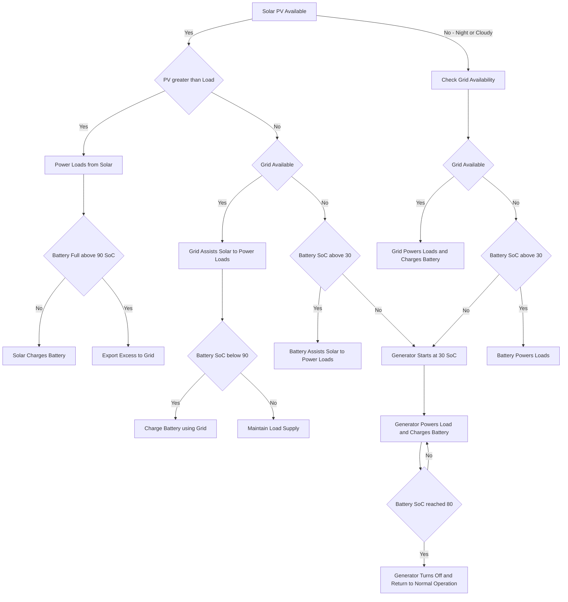

```mermaid
flowchart TD

A[Solar PV Available] -->|Yes| B{PV greater than Load}
A -->|No - Night or Cloudy| X[Check Grid Availability]

B -->|Yes| C[Power Loads from Solar]
C --> D{Battery Full above 90 SoC}
D -->|No| E[Solar Charges Battery]
D -->|Yes| F[Export Excess to Grid]

B -->|No| G{Grid Available}

G -->|Yes| H[Grid Assists Solar to Power Loads]
H --> I{Battery SoC below 90}
I -->|Yes| J[Charge Battery using Grid]
I -->|No| K[Maintain Load Supply]

G -->|No| L{Battery SoC above 30}
L -->|Yes| M[Battery Assists Solar to Power Loads]
L -->|No| O[Generator Starts at 30 SoC]

O --> P[Generator Powers Load and Charges Battery]

P --> U{Battery SoC reached 80}
U -->|Yes| V[Generator Turns Off and Return to Normal Operation]
U -->|No| P

X --> Q{Grid Available}

Q -->|Yes| R[Grid Powers Loads and Charges Battery]

Q -->|No| S{Battery SoC above 30}
S -->|Yes| T[Battery Powers Loads]
S -->|No| O
```
