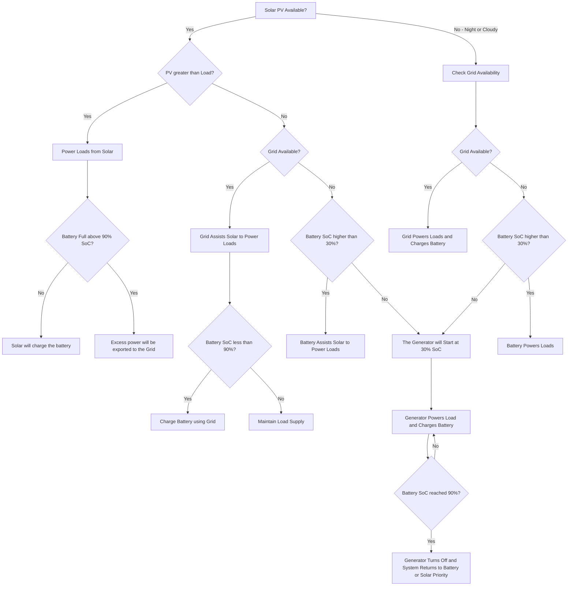

```mermaid
flowchart TD

A[Solar PV Available?] -->|Yes| B{PV greater than Load?}
A -->|No - Night or Cloudy| X[Check Grid Availability]

B -->|Yes| C[Power Loads from Solar]
C --> D{Battery Full above 90% SoC?}
D -->|No| E[Solar will charge the battery]
D -->|Yes| F[Excess power will be exported to the Grid]

B -->|No| G{Grid Available?}

G -->|Yes| H[Grid Assists Solar to Power Loads]
H --> I{Battery SoC less than 90%?}
I -->|Yes| J[Charge Battery using Grid]
I -->|No| K[Maintain Load Supply]

G -->|No| L{Battery SoC higher than 30%?}
L -->|Yes| M[Battery Assists Solar to Power Loads]
L -->|No| O[The Generator will Start at 30% SoC]

O --> P[Generator Powers Load and Charges Battery]

P --> U{Battery SoC reached 90%?}
U -->|Yes| V[Generator Turns Off and System Returns to Battery or Solar Priority]
U -->|No| P

X --> Q{Grid Available?}

Q -->|Yes| R[Grid Powers Loads and Charges Battery]

Q -->|No| S{Battery SoC higher than 30%?}
S -->|Yes| T[Battery Powers Loads]
S -->|No| O
```
